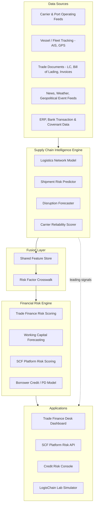

# LogisChain Intelligence: A Dual-Domain AI System for Supply-Chain-Aware Financial Risk

### With LogisChain Lab — a gamified simulation platform for trade finance and supply chain risk training

---

## Executive Summary

Trade finance desks, working capital platforms, and credit teams price and monitor exposures that are, in practice, bets on physical logistics performing as promised. A letter of credit assumes the underlying shipment arrives. A reverse-factoring program assumes the supplier's inbound materials clear customs on schedule. A borrower's revolving credit line assumes their outbound goods reach customers and get paid for. Yet the financial models governing these decisions are almost always built on financial data alone — payment history, financial statements, bureau scores — while the logistics data that would reveal deterioration *before* it hits the balance sheet sits in a separate system, owned by a separate team, refreshed on a separate schedule.

**LogisChain Intelligence** closes that gap. It is a dual-domain AI system that fuses a **Supply Chain Intelligence Engine** (network modeling, shipment risk prediction, disruption forecasting, carrier reliability analytics) with a **Financial Risk Engine** (trade finance scoring, working capital forecasting, SCF platform risk, borrower credit risk) through a shared fusion layer, so that a container stuck in a congested port shows up as a repriced risk factor in a credit model within the same operating day — not in next quarter's covenant review.

This document specifies that system (Part I) and then specifies **LogisChain Lab** (Part II), a gamified simulation built on the same conceptual model, where learners run a trade finance and supply chain finance book through twelve simulated quarters of shipping-lane disruptions, learning by consequence rather than by lecture. A working interactive prototype of the simulator accompanies this document.

---

## Part I — The Dual-Domain AI System

### 1. Why fuse these two domains

Financial risk models treat "operational" disruption as an exogenous shock — something that shows up as a missed payment after the fact. Supply chain systems, meanwhile, generate rich leading indicators (carrier reliability drift, port dwell times, chokepoint congestion, vessel schedule reliability) that never reach the credit or trade finance desk in a form a risk model can consume. The result is that logistics-dependent exposures get priced and monitored as if they were ordinary corporate credits, when in fact a meaningful share of their default and delay risk originates upstream, in a network the lender never sees.

Fusing the two domains means every financial risk score has a **traceable logistics provenance**: a risk officer can see not just that a borrower's probability of default moved, but *why* — which lane, which carrier, which chokepoint, and how confident the underlying forecast is.

### 2. System architecture

The system is organized in five layers: data sources feed the Supply Chain Intelligence Engine, whose outputs are normalized in a fusion layer and consumed by the Financial Risk Engine, which in turn powers the applications trade finance desks, SCF platforms, and credit teams actually use.

Two design choices carry the most weight:

- **The fusion layer is explicit, not implicit.** Supply chain signals never feed a financial model directly; they pass through a documented crosswalk (Section 5) that maps a specific logistics metric to a specific financial risk factor, with a stated transformation and confidence weight. This is what makes the system auditable to a model risk committee.
- **Signals flow to applications directly as well as through the risk engine.** A desk officer should be able to see "carrier reliability on this lane dropped 14 points" as a raw signal, not only as an already-blended score, so they can sanity-check the model's read of the world.

### 3. Domain A — Supply Chain Intelligence Engine

| Component | What it does | Core method | Primary output |
|---|---|---|---|
| **Logistics Network Model** | Represents the physical trade network as a graph: ports, warehouses, and carriers as nodes; shipping lanes, rail corridors, and trucking routes as edges, each edge carrying live capacity, congestion, and transit-time attributes | Dynamic graph representation, updated from AIS/GPS feeds, port authority data, and customs clearance timestamps | A live network graph queryable for shortest-path, chokepoint dependency, and route-concentration analysis |
| **Shipment Risk Predictor** | Estimates the probability and expected magnitude of delay for an individual shipment or trade transaction | Gradient-boosted or survival model over route, carrier, cargo type, season, and current network state features | Per-shipment delay probability and expected-days-late distribution |
| **Demand-Supply Disruption Forecaster** | Forecasts the likelihood of a disruption event on a given lane or chokepoint over a forward window (7/30/90 days) | Time-series forecasting blended with event/NLP signal extraction from news, weather, and customs/regulatory feeds; ensemble combines statistical and causal-factor models | Forward-looking disruption probability by lane, with named contributing factors |
| **Carrier Reliability Analytics** | Scores carriers and terminal operators on historical and trending on-time performance, claims history, and financial stability signals | Rolling scorecard methodology (schedule reliability, dwell-time variance, claims ratio) combined with a trend component that weights recent performance more heavily | Carrier reliability score (0–100) with directional trend flag |

**Design notes.** The disruption forecaster is deliberately kept separate from the shipment risk predictor: the former answers "how likely is something to go wrong on this lane in general," the latter answers "how exposed is this specific shipment if it does." Financial models need both — a lane-level early warning for portfolio-level concentration risk, and a shipment-level number for pricing an individual exposure.

### 4. Domain B — Financial Risk Models

| Model | Purpose | Supply chain features consumed | Output |
|---|---|---|---|
| **Trade Finance Risk Scoring** | Prices and monitors documentary credit (LC), documentary collection, and guarantee exposures | Shipment delay probability, carrier reliability on the named vessel/carrier, route disruption forecast, document-discrepancy history correlated with route congestion | Risk-adjusted score per transaction; discrepancy and non-performance probability |
| **Working Capital Forecasting** | Forecasts a borrower's cash conversion cycle to support revolving facility sizing and covenant monitoring | Inbound/outbound shipment delay distributions, port dwell trends on the borrower's key lanes, inventory-in-transit valuation | Forward cash conversion cycle estimate with confidence band |
| **SCF Platform Risk Scoring** | Prices dynamic discounting and reverse-factoring risk for anchor-buyer supply chain finance programs | Supplier-side route disruption forecasts, carrier concentration on supplier's inbound lanes, chokepoint dependency | Early-payment default probability; program-level concentration risk flag |
| **Credit Risk — Logistics-Dependent Borrowers** | Feeds a probability-of-default (PD) model for borrowers whose revenue or cost base is materially exposed to specific trade lanes | Route/chokepoint concentration relative to borrower revenue, carrier reliability trend on critical lanes, disruption forecast confidence | PD adjustment factor layered onto traditional financial-statement PD |

**Design notes.** None of these models replace the underlying financial-statement or transaction-level analysis a desk already does; each supply chain feature enters as an *adjustment factor* with a bounded, disclosed weight, so a spike in one signal cannot silently dominate a score. This keeps the system additive to existing risk frameworks rather than a black-box replacement for them.

### 5. Fusion layer: risk factor crosswalk

The crosswalk is the contract between the two domains. A sample of the mapping:

| Supply chain signal | Financial risk factor it feeds | Model affected | Transformation |
|---|---|---|---|
| Carrier reliability score, 30-day trend | Delivery/performance risk premium | Trade Finance Risk Scoring | Score below 65 adds a graduated premium; trend direction weighted 2x level |
| Port/route congestion index | Cash conversion cycle extension (days) | Working Capital Forecasting | Congestion band mapped to expected added transit days, propagated through CCC formula |
| 7-day route disruption probability | Inventory-in-transit valuation haircut | SCF eligible-receivables pricing | Probability above threshold triggers a haircut schedule on receivables collateral |
| Chokepoint concentration (% of borrower volume through a single corridor) | Portfolio concentration / correlated-exposure flag | Credit Risk, portfolio VaR | Feeds a correlation add-on in portfolio-level risk aggregation, not just single-name PD |
| Demand-supply imbalance forecast | Borrower revenue volatility adjustment | Borrower Credit / PD Model | Adjusts revenue volatility assumption feeding the PD model's stress scenarios |

### 6. Governance, explainability, and data

- **Explainability.** Every fused risk score carries a factor breakdown (which signals moved it, by how much) so a credit committee can trace a rating change back to a named lane or carrier, not just a model version number.
- **Confidence-aware scoring.** Disruption forecasts carry explicit confidence intervals; low-confidence signals are down-weighted automatically in the crosswalk rather than treated as certain.
- **Model risk boundaries.** Supply chain adjustment factors are capped (e.g., no single signal can move a PD by more than a defined number of notches) so the system degrades gracefully if a data feed is stale or wrong.
- **Data sources.** Carrier and port operating feeds, AIS/vessel tracking, customs and clearance timestamps, trade documentation (LC text, bills of lading, invoices), weather and geopolitical event feeds, and the institution's own ERP/transaction/covenant data.
- **Illustrative technical stack.** Graph database (network model) · gradient-boosted and survival models (shipment risk) · time-series/ensemble forecasting with NLP event extraction (disruption forecasting) · feature store shared across both domains · rules-bounded scoring layer (fusion) · existing PD/rating infrastructure at the financial model layer, extended rather than replaced.

### 7. Illustrative walkthrough

A reverse-factoring program finances a mid-market electronics supplier whose inbound components move through the Jebel Ali–Rotterdam corridor. The Disruption Forecaster flags a 42% seven-day probability of Suez corridor disruption, up from 12% the prior week, driven by a spike in regional security advisories. The fusion layer applies the receivables haircut schedule, and the SCF program's risk score for that supplier tier moves before any payment is missed. The desk sees the underlying signal — not just the new number — and can choose to tighten advance rates on that tier, request alternate-carrier confirmation from the supplier, or simply monitor. Two weeks later, if the corridor disruption materializes, the program has already re-priced; if it doesn't, the haircut relaxes automatically as the forecast confidence decays.

---

## Part II — LogisChain Lab: Gamified Simulation Platform

### 1. Purpose and audience

LogisChain Lab operationalizes Part I's system as a training environment. Rather than reading about how supply chain signals should inform financial decisions, a learner runs a live book and feels the consequence of ignoring a carrier reliability warning or over-concentrating exposure on a single chokepoint. It is built for:

- Trade finance and SCF desk analysts (onboarding and continuing education)
- Credit risk teams covering logistics-dependent borrowers
- Corporate treasury and working capital teams
- Business school and executive education programs in trade finance or supply chain risk

### 2. Core gameplay loop

Each simulated **quarter** runs a fixed sequence:

1. **Intelligence phase** — the AI Signal Feed updates: carrier reliability scores drift, congestion levels shift, and the network map re-renders to reflect current lane health. This is the game's stand-in for the Supply Chain Intelligence Engine in Part I.
2. **Event phase** — a disruption (or, occasionally, a demand opportunity) may trigger on one or more lanes, flagging any tied position as "at risk" or "opportunity."
3. **Decision phase** — the learner has a limited budget of **action points** to hedge, reduce, extend, or invest in lane resilience across their portfolio.
4. **Resolution phase** — unmitigated at-risk positions take a write-down and a credit-rating downgrade; hedged or reduced positions are protected; captured opportunities add to realized P&L. The quarter advances.

This loop repeats for **twelve quarters** (three simulated years), after which the learner receives a performance report.

### 3. Player role and starting portfolio

The learner takes over a **$10.0M** book of six exposures spanning trade finance (letters of credit), invoice discounting, and supply chain finance (reverse factoring, dynamic discounting), plus **$2.0M** in cash, across a six-hub global network (Shanghai, Los Angeles, Rotterdam, Jebel Ali, Mumbai, Santos) connected by seven trade lanes — including two lanes that share the Suez corridor as a common chokepoint, so a single geopolitical event can cascade across multiple positions at once, the same concentration-risk lesson institutional desks learn the hard way.

### 4. Disruption engine

| Event | Logistics impact | Financial transmission | Advance warning |
|---|---|---|---|
| Port Congestion Surge | Reliability -20, congestion → High on one lane | 8% write-down if unmitigated | Visible in signal feed trend |
| Carrier Insolvency | Reliability -35 on one lane | 15% write-down if unmitigated | Partial — reliability was already declining |
| Suez Corridor Disruption | Reliability -25 on **both** Suez-linked lanes simultaneously | 12% write-down each if unmitigated | Tests whether learner diversified away from shared chokepoints |
| Panama Corridor Restriction | Reliability -18, congestion → High | 10% write-down if unmitigated | Visible in signal feed trend |
| Demand Surge (positive) | Congestion → Medium, no reliability penalty | +5% value if learner extends credit into it | N/A — upside event |
| Port Systems Cyberattack | Reliability -22, congestion → High | 10% write-down if unmitigated | **None** — deliberately a "black swan" to teach that not all risk is forecastable |

Events are weighted-random each quarter (roughly a 60% chance of some event firing), so no two playthroughs unfold the same way.

### 5. Decision set

| Action | Effect | Cost | Action points |
|---|---|---|---|
| **Hedge** | Shields a position from its next write-down | ~3% of exposure, paid from cash | 1 |
| **Reduce / rebalance** | Permanently shrinks exposure by 30%, clearing risk on the reduced portion | ~1% unwind cost on the reduced amount | 1 |
| **Extend credit** | Grows exposure by 20% (only available when the position is not currently at risk) | Full amount, paid from cash | 1 |
| **Invest in carrier resilience** | Permanently improves a lane's baseline reliability and dampens future disruption severity on it by ~40% | $150,000 flat, one-time per lane | 1 |

Two action points per quarter force prioritization — the learner cannot protect every position every quarter, mirroring the real constraint of limited desk capacity and hedging budget.

### 6. Scoring and progression

- **Realized P&L** — cumulative gains and losses from write-downs, unwind costs, hedging premiums, and captured upside.
- **Resilience score** — the share of disruption events that hit the learner's book without an unmitigated write-down.
- **Final grade (S/A/B/C/D)** — a blend weighted toward total return with a meaningful resilience component, so a learner who took reckless yield and got lucky scores lower than one who managed risk consistently, even at similar raw returns.

### 7. Debrief and pedagogy

At the twelve-quarter mark, the learner receives a report comparing starting and ending portfolio value, total return, resilience percentage, and events faced. Because every write-down in the operations log is tied to a named signal that was visible in the AI Signal Feed before resolution, the debrief experience is designed to let a learner (or instructor) trace every loss back to a specific ignored or mistimed decision — the same explainability principle that governs the production system in Part I.

### 8. From prototype to production

The accompanying interactive build (`logischain-lab.html`) is a fully playable single-session prototype: a six-hub network, six positions, a weighted disruption engine, and the full turn loop described above, running entirely client-side. Extending it toward a production learning platform would mean:

- **Persistence and cohorts** — save learner progress and portfolio history, and support instructor-assigned scenarios or timed cohort competitions with a shared leaderboard.
- **Difficulty tiers** — a Level 2/3 progression with a larger network, correlated multi-lane portfolios, and borrower-side financial statements layered on top of the logistics signals, closer to real credit files.
- **Real disruption replay mode** — an optional mode seeded with historical events (e.g., a past canal closure or carrier bankruptcy) so learners practice against real, not only simulated, shocks.
- **Connection to Part I's data model** — the same fusion-layer crosswalk (Section I.5) that powers the production system can generate the game's signal feed and event severities, so the simulator and the live system stay conceptually identical as the production model evolves.

---

## Roadmap

| Phase | Focus |
|---|---|
| 1 | Stand up the Supply Chain Intelligence Engine on 2–3 pilot trade lanes with existing carrier/port data feeds; validate shipment risk and disruption forecasts against historical outcomes |
| 2 | Build the fusion layer crosswalk with model risk sign-off; integrate first financial model (recommend starting with SCF platform risk — shortest feedback loop, clearest ROI) |
| 3 | Extend fusion layer to trade finance scoring and borrower credit risk; add explainability tooling for credit committee review |
| 4 | Launch LogisChain Lab internally for desk onboarding, seeded from the same signal taxonomy as the production system |
| 5 | Expand network coverage, add correlated multi-lane portfolio risk aggregation, and open the simulator to external training/education partners |
